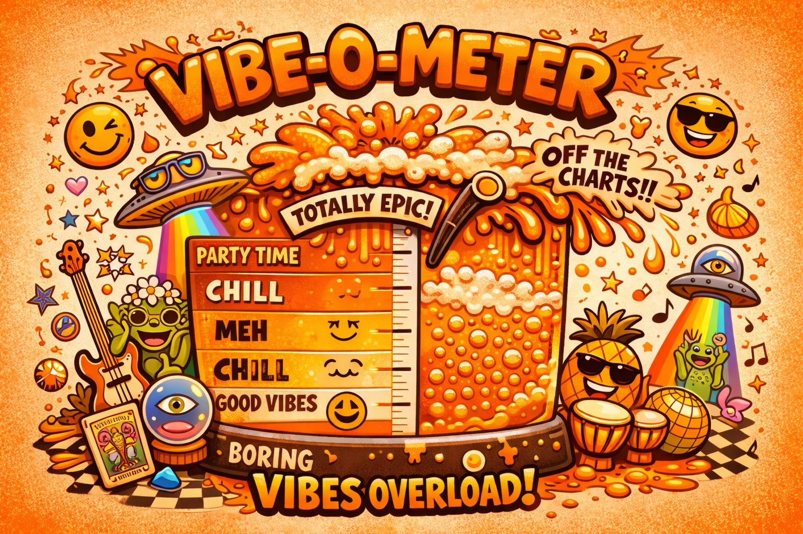

  

# VibeRadiant ✨🚀🧨

> Radiant with mad vibes and ludicrous new features. Expect turbo-charged workflows, unapologetic UI spice, and editor power-ups on blast. 💥🛠️🎛️

VibeRadiant is a fork of [NetRadiant-Custom (NRC)](https://github.com/NetRadiant/NetRadiant-custom). Massive thanks and credit to the NRC team for the foundation this project remixes and supercharges. 🙌🧠🧪

## Goal 🎯🔥
Build the most overclocked, vibe-drenched Radiant experience on the planet: lightning-fast level editing, extra-loud workflows, and ludicrous new features that go way past "just fine." ⚡🧨✨

## What's New vs NetRadiant-Custom 💫🧩
### Editor Overdrive ⚡🧱
- 🔥💡 Real-time camera lighting preview (point/surface/sky lights) for instant feedback.
- 🧠🔗 TrenchBroom-style linked duplicates for synchronized group transforms.
- 🧭📏 Z-bar vertical ruler plus full interaction parity in 2D view.
- 🎛️🔍 Refreshed texture browser with unified filters and fast search.
- ✨🧪 Quake 3 shader pipeline rendering with accurate multi-stage previews, hover animation, a live shader editor preview, and a 3D view animation toggle.
- 🧲🔊 Asset browser tabs for entities and sounds with drag-and-drop placement.
- ✂️🟥 Clipper preview style options, including the loud VIBE red-dash mode.
- 🧱🧲 "Drop Entities to Floor" command for fast placement cleanup.
- 🌊🧪 idTech2 filter improvements honoring surface/content flags.
- 🧬🧩 Extra model types in gamepacks (MD5/IQM) for wider editor visibility.

### Tooling & Release Chaos 📦⚙️
- 🚀🔄 In-app auto-updater plus update manifest workflow for Windows zip, Linux AppImage, and macOS tar.gz releases.
- 📌📄 VERSION file and release packaging flow for consistent builds.

For the full documented diff, see [CHANGES_FROM_NRC.md](CHANGES_FROM_NRC.md). 📜✨

## Downloads 📦🚀
Grab fresh builds from [Releases](../../releases). 🎉💿

## Build It 🛠️⚙️
See [COMPILING](COMPILING) for platform-by-platform build instructions. 🔧🧪

  

## Docs & Deep Dives 📚🔍
- 🧾📜 [CHANGES_FROM_NRC.md](CHANGES_FROM_NRC.md) - VibeRadiant vs NRC change log.
- 📓🧨 [docs/changelog-custom.txt](docs/changelog-custom.txt) - detailed editor/compiler change notes.
- 🧪🔄 [docs/auto-updater.md](docs/auto-updater.md) - update flow details.
- 🧱🎮 [docs/idtech4-support.md](docs/idtech4-support.md) - idTech4 parity notes and The Dark Mod support details.
- 🗂️🎮 [docs/gamepacks-architecture.md](docs/gamepacks-architecture.md) - pack source/runtime layout and unification policy.
- 🌐🗣️ [docs/language-packs.md](docs/language-packs.md) - language pack format and supported languages.
- 🤖🧱 [docs/ai-level-design-tools.md](docs/ai-level-design-tools.md) - OpenAI-powered level-design tool suite and rollout plan.
- 🏗️🔧 [COMPILING](COMPILING) - build instructions.
- 📦🧬 [RELEASING.md](RELEASING.md) - versioning and release pipeline.
- 🧱🎛️ [docs/Additional_map_editor_features.htm](docs/Additional_map_editor_features.htm) - editor feature catalog.
- 🧨🧮 [docs/Additional_map_compiler_features.htm](docs/Additional_map_compiler_features.htm) - compiler feature catalog.

## Credits & Base Project 🙏🧱
VibeRadiant builds on [NetRadiant-Custom (NRC)](https://github.com/NetRadiant/NetRadiant-custom). Please check out the upstream project and give it the love it deserves. 💖🏗️

The bundled idTech2 compiler suite is based on [VibeyMapTools](https://github.com/themuffinator/VibeyMapTools), itself derived from Eric Wasylishen's ericw-tools, and is distributed under GPL-3.0. 🛠️📜

## License 📜⚖️
See [LICENSE](LICENSE), [GPL](GPL), and [LGPL](LGPL) for licensing details. ⚖️🧾
